# Design Document 

Authors: Simone Pistilli, Yasser Hobballah, Giorgio Rasetto

Date: 30-4-2021

Version: 1.0

# Contents

- [Design Document](#design-document)
- [Contents](#contents)
- [Instructions](#instructions)
- [High level design](#high-level-design)
- [Low level design](#low-level-design)
- [Verification traceability matrix](#verification-traceability-matrix)
- [Verification sequence diagrams](#verification-sequence-diagrams)
  - [Scenario 1.1](#scenario-11)
  - [Scenario 1.2](#scenario-12)
  - [Scenario 1.3](#scenario-13)
  - [Scenario 2.1](#scenario-21)
  - [Scenario 2.2](#scenario-22)
  - [Scenario 2.3](#scenario-23)
  - [Scenario 3.1](#scenario-31)
  - [Scenario 3.2](#scenario-32)
  - [Scenario 3.3](#scenario-33)
  - [Scenario 4.1](#scenario-41)
  - [Scenario 5.1](#scenario-51)
  - [Scenario 6.1](#scenario-61)
  - [Scenario 6.2](#scenario-62)
  - [Scenario 6.3](#scenario-63)
  - [Scenario 6.4](#scenario-64)
  - [Scenario 6.5](#scenario-65)
  - [Scenario 7.1](#scenario-71)
  - [Scenario 7.2](#scenario-72)
  - [Scenario 7.3](#scenario-73)
  - [Scenario 7.4](#scenario-74)
  - [Scenario 8.1](#scenario-81)
  - [Scenario 8.2](#scenario-82)
  - [Scenario 9.1](#scenario-91)

# Instructions

The design must satisfy the Official Requirements document, notably functional and non functional requirements

# High level design 

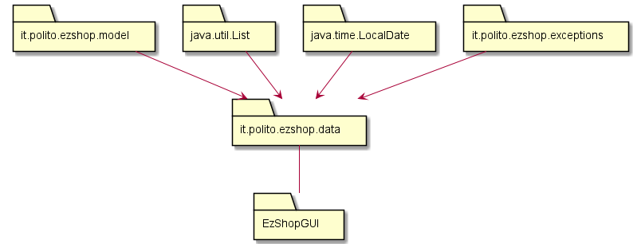

The Architecture used is the 3 tier architect where we have 3 layers (Presentation-Applicationlogic-Data).Also the MVC Pattern is Used to manage state interfaces with DB and render on UI.
# Low level design

<for each package, report class diagram>

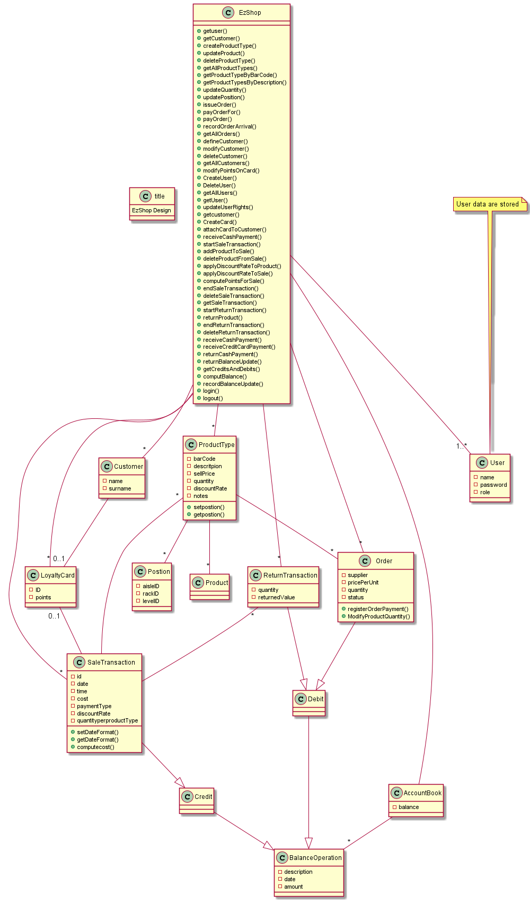

The Used Design Pattern is the Facade.

# Verification traceability matrix

\<for each functional requirement from the requirement document, list which classes concur to implement it>

|   |  EzShop |SaleTransaction   |LoyaltyCard   | User  |Customer   |Order   |ReturnTransaction   |Product   |ProductType   |AccountBook   |Position|credit|debit|FinancialTransaction |
|---|---|---|---|---|---|---|---|---|---|---|---|---|---|---|
|  FR1 | x |   |   | x |   |   |   |   |   |   |   |   |   |   |
|  FR3 | x |   |   |   |   |   |   |   | x |   | x |   |   |   |
|  FR4 | x |   |   |   |   | x |   |   | x | x | x |   | x | x |
|  FR5 | x |   | x |   | x |   |   |   |   |   |   |   |   |   |
|  FR6 | x | x |   |   |   |   |   | x | x | x |   | x |   | x | 
|  FR7 | x |   |   |   | x |   | x |   |   | x |   | x | x | x |
|  FR8 | x |   |   |   |   |   |   |   |   | x |   | x | x | x |

# Verification sequence diagrams 
\<select key scenarios from the requirement document. For each of them define a sequence diagram showing that the scenario can be implemented by the classes and methods in the design>

<!--1.1-->

## Scenario 1.1

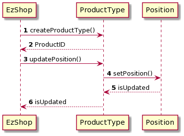

<!--1.2-->
## Scenario 1.2

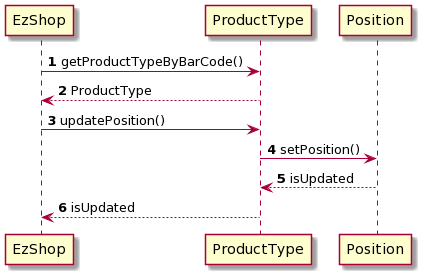

<!--1.3-->
## Scenario 1.3

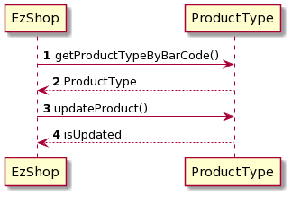

<!--2.1-->
## Scenario 2.1

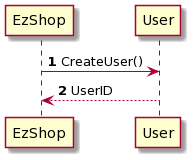

<!--2.2-->
## Scenario 2.2

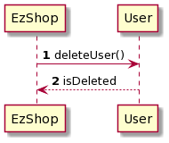

<!--2.3-->
## Scenario 2.3

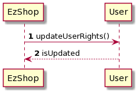

<!--3.1-->
## Scenario 3.1

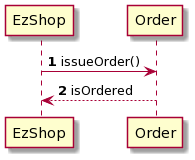

<!--3.2-->
## Scenario 3.2

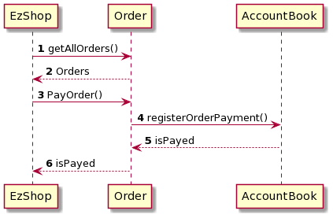

<!--3.3-->
## Scenario 3.3

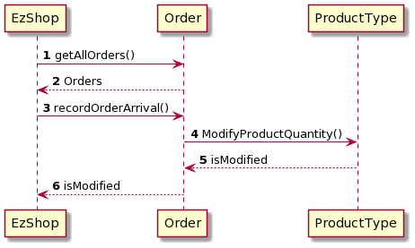

## Scenario 4.1

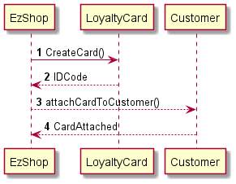
<!--4.1-->
## Scenario 5.1
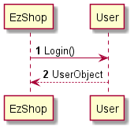
<!--5.1-->
## Scenario 6.1
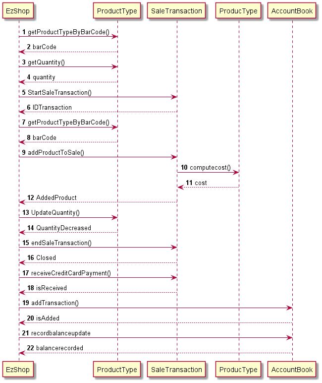
<!--6.1-->
## Scenario 6.2
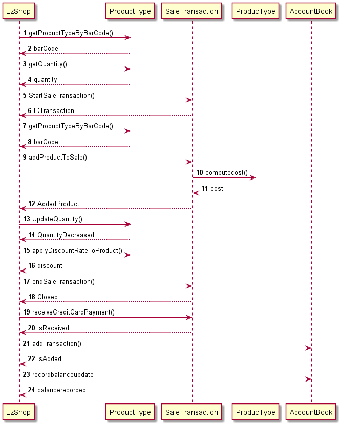
<!--6.2-->
## Scenario 6.3
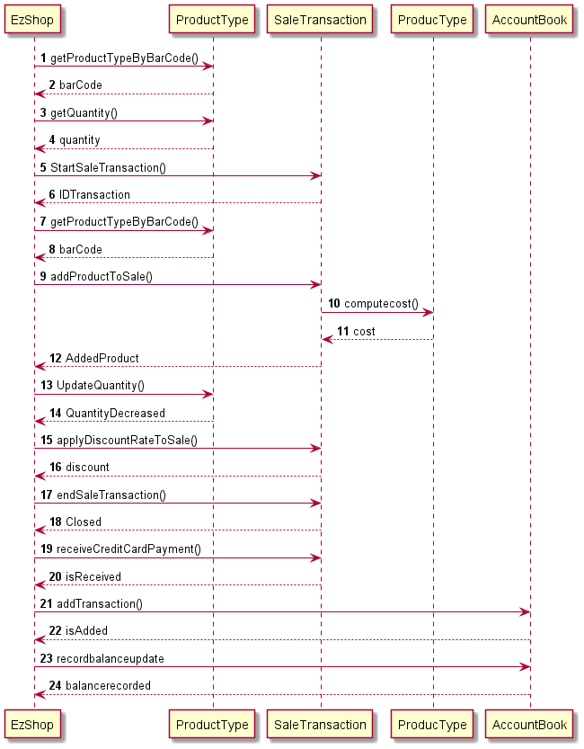
<!--6.3-->
## Scenario 6.4
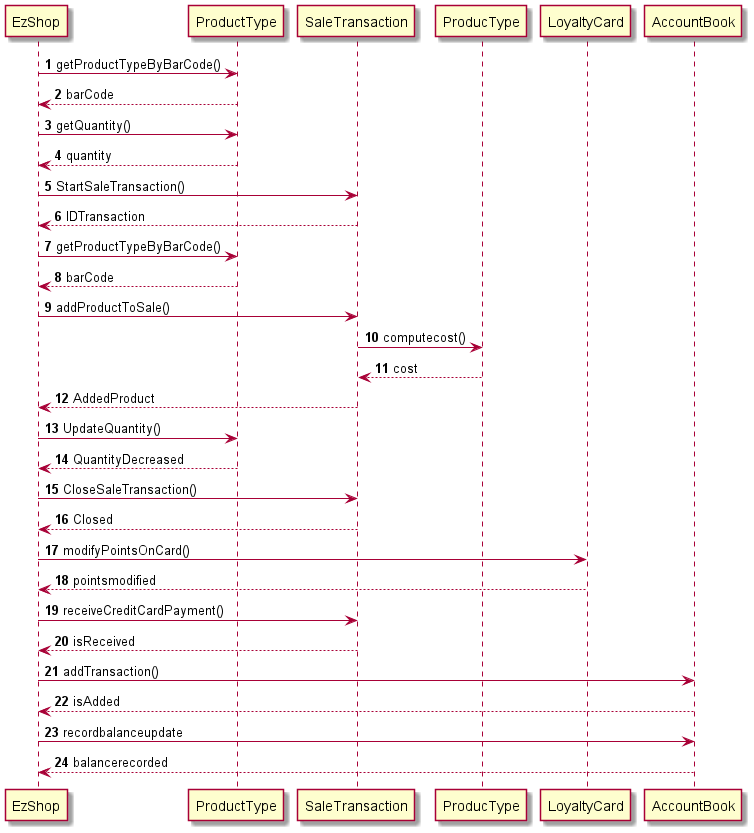
<!--6.4-->
## Scenario 6.5
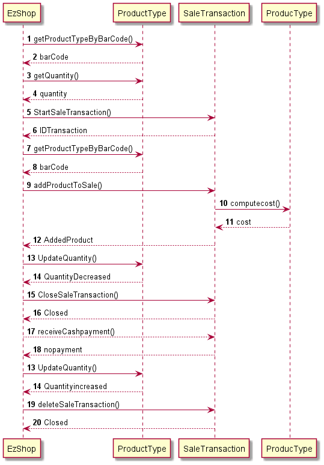
<!--6.5-->

<!--7.1-->
## Scenario 7.1
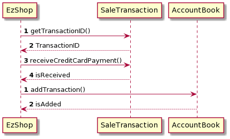

<!--7.2-->
## Scenario 7.2
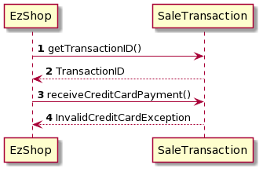

<!--7.3-->
## Scenario 7.3

<!--7.4-->
## Scenario 7.4
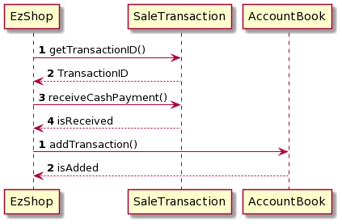

<!--8.1-->
## Scenario 8.1
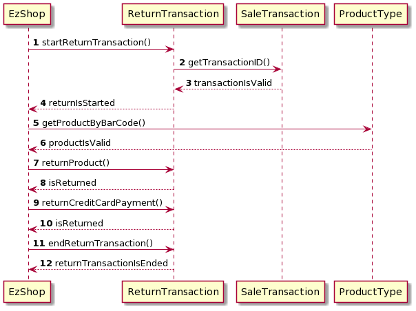

<!--8.2-->
## Scenario 8.2
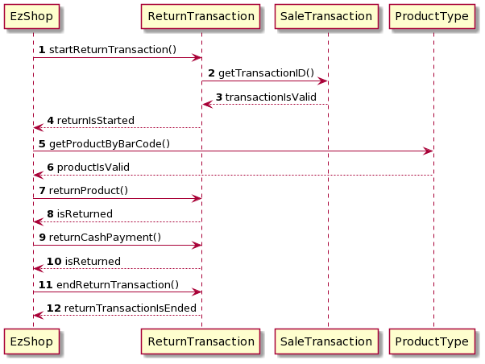

<!--9.1-->
## Scenario 9.1
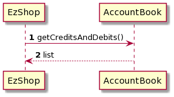

