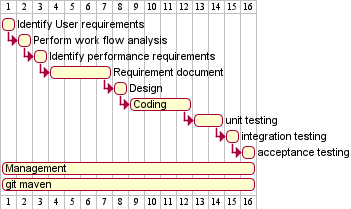

1
2
3
4
5
6
7
8
9
10
11
12
13
14
15
16
17
18
19
20
21
22
23
24
25
26
27
28
29
30
31
32
33
34
35
36
37
38
39
40
41
42
43
44
45
46
47
48
49
50
51
# Project Estimation  
Authors:Simone Pistilli, Yasser Hobballah, Giorgio 

Date: 25-4-2021
Version:1.0
# Contents
- [Estimate by product decomposition]
- [Estimate by activity decomposition ]
# Estimation approach
<Consider the EZShop  project as described in YOUR requirement document, assume that you are going to develop the project INDEPENDENT of the deadlines of the course>
# Estimate by product decomposition
### 
|             | Estimate                        |             
| ----------- | ------------------------------- |  
| NC =  Estimated number of classes to be developed   |               15   classes           |             
|  A = Estimated average size per class, in LOC       |                 250 LOC          | 
| S = Estimated size of project, in LOC (= NC * A) |3750 LOC |
| E = Estimated effort, in person hours (here use productivity 10 LOC per person hour)  |               375  person hours               |   
| C = Estimated cost, in euro (here use 1 person hour cost = 30 euro) | 11250 euro | 
| Estimated calendar time, in calendar weeks (Assume team of 4 people, 8 hours per day, 5 days per week ) |      2 Calander Weeks and 2 Calander days     |               
# Estimate by activity decomposition
### 
|         Activity name    | Estimated effort (person hours)   |             
| ----------- | ------------------------------- | 
|Identify User requirements | 8 |
|Perform work flow analysis | 2 |
|Identify performance requirements | 5 |
|Requirement document | 50 |
|Design | 20 |
|Coding | 150 |
|unit testing | 50 |
|integration testing | 30 |
|acceptance testing| 20 |
|management| 25 |
|git maven| 15 |
###
Insert here Gantt chart with above activities



```
@startgantt
[Identify User requirements] lasts 1 days
[Perform work flow analysis] lasts 1 days
[Identify performance requirements] lasts 1 days
[Requirement document] lasts 2 days
then [Design] lasts 1 days
then [Coding] lasts 5 days
then [unit testing] lasts 2 days
then [integration testing] lasts 1 days
then [acceptance testing] lasts 1 days
[Management] lasts 12 days
[git maven] lasts 12 days
@endgantt
```