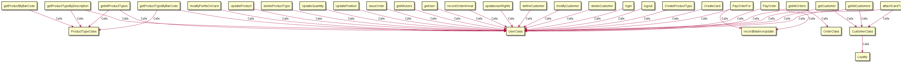
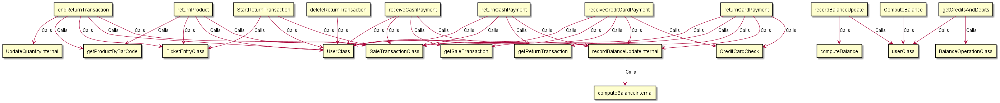
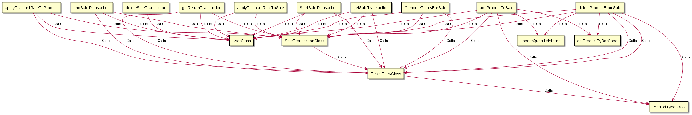
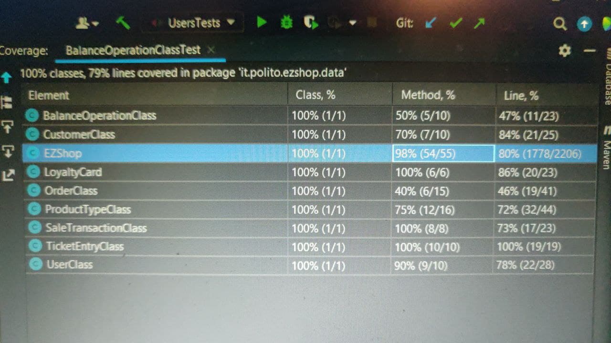

# Integration and API Test Documentation

Authors: Yasser Hobballah, Giorgio Rasetto, Simone Pistilli

Date: 26 May 2021

Version: 1.0

# Contents

- [Dependency graph](#dependency graph)

- [Integration and API Test Documentation](#integration-and-api-test-documentation)
- [Contents](#contents)
- [Dependency graph](#dependency-graph)
- [Integration approach](#integration-approach)
- [Tests](#tests)
  - [Step 1](#step-1)
  - [Step 2](#step-2)
  - [Step 3](#step-3)
- [Scenarios](#scenarios)
  - [Scenario UC2.3](#scenario-uc23)
  - [Scenario UC2.4](#scenario-uc24)
  - [Scenario UC5.3](#scenario-uc53)
  - [Scenario UC9.1](#scenario-uc91)
  - [Scenario UC9.2](#scenario-uc92)
  - [Scenario UC9.2](#scenario-uc92-1)
  - [Scenario UC4.1](#scenario-uc41)
  - [Scenario UC6.1](#scenario-uc61)
- [Coverage of Scenarios and FR](#coverage-of-scenarios-and-fr)
- [EZShop Final Coverage](#ezshop-final-coverage)
- [Coverage of Non Functional Requirements](#coverage-of-non-functional-requirements)
    - 

- [Tests](#tests)

- [Scenarios](#scenarios)

- [Coverage of scenarios and FR](#scenario-coverage)
- [Coverage of non-functional requirements](#nfr-coverage)

# Dependency graph 

     <report the here the dependency graph of the classes in EzShop, using plantuml>

# Integration approach
<!--bottom up APPRAOCH WILL BE USED IS EASIER-->
    <Write here the integration sequence you adopted, in general terms (top down, bottom up, mixed) and as sequence
    (ex: step1: class A, step 2: class A+B, step 3: class A+B+C, etc)> 
    <Some steps may  correspond to unit testing (ex step1 in ex above), presented in other document UnitTestReport.md>
    <One step will  correspond to API testing>
     BOTTOM UP INTEGRATION SEQUENCE IS ADOPTED

#  Tests
<!-------------------------black box integration Testing ( find test cases in Junit)-------------------------------------->
   <define below a table for each integration step. For each integration step report the group of classes under test, and the names of
     JUnit test cases applied to them> JUnit test classes should be here src/test/java/it/polito/ezshop
<!------------------------------  WE SHOULD HAVE AT LEAST 1 TESTCASE PER METHOD------------------------------------------->
## Step 1
| Classes               | JUnit test cases      | <!--Unit Tests-->
| --------------------- | --------------------- |
| UserClass             | UserClassTest         |
| BalanceOperationClass | BalanceOperationClass |
| OrderClass            | OrderClassTest        |
| ProductTypeClass      | ProductTypeClassTest  |
| LoyaltyCard           | LoyaltyCardTest       |

## Step 2
| Classes                     | JUnit test cases |
| --------------------------- | ---------------- |
| EzShop                      | CreateUserTest   |   <!--Api Tests 2nd level-->
|                             | deleteUserTest   |
| EzShop - UserClass          | getAllUsersTest  |
|                             | getUserTest      |
|                             | updateUserRightsTest  |
|                             | loginTest  |
|                             | logoutTest   |
|                             | CreateProductTypeTest   |
|                             | UpdateProductTest   |
|                             | deleteProductTypeTest   |
|                             |  UpdateQuantityTest  |
|                             |  UpdatePositionTest  |
|                             | issueOrderTest   |
|                             | PayOrderForTest   |
|                             | PayOrderTest   |
|                             | recordOrderArrivalTest   |
|                             |  defineCustomerTest  |
|                             | modifyCustomerTest  |
|                             |  deleteCustomerTest  |
|                             |  CreateCardTest  |
|                             |  modifyPointsOnCardTest  |
|                             | deleteSaleTransactionTest   |
|                             | deleteReturnTransactionTest   |
|                             | ComputeBalanceTest|
| EzShop - UserClass - ProductTypeClass |    getAllProductTypesTest    |
|                             |  getProductTypeByBarCodeTest  |
|                             | getProductTypeByDescriptionTest   |
| EzShop - ProductTypeClass      |    getProductByBarCodeTest       |
|                             |    |
| EzShop - OrderClass - UserClass      |     getAllOrdersTest             |
| EzShop - CustomerClass - UserClass      |   getCustomerTest      |
|                             | getAllCustomersTest   |
|                             |  attachCardToCustomerTest  |
|                            |    |
| EzShop - UserClass - SaleTransactionClass |StartSaleTransactionTest  |
|                             |  applyDiscountRateToSaleTest  |
|                             |  receiveCashPaymentTest  |
|                             |  receiveCreditCardPaymentTest  |
|                             | returnCashPaymentTest   |
|                             | returnCardPaymentTest  |
|                             |  deleteSaleTransactionTest  |
| EzShop - UserClass - SaleTransactionClass - TicketEntryClass |StartSaleTransactionTest  |
|                             |  applyDiscountRateToProductTest  |
|                             | ComputePointsForSaleTest   |
|                             |  endSaleTransactionTest  |
|                             | getSaleTransactionTest   |
|                             | getReturnTransactionTest   |
|                             |  StartReturnTransactionTest  |
|                             | returnProductTest   |
|                             |  endReturnTransactionTest  |
|                             |    |
| EzShop - UserClass - SaleTransactionClass - TicketEntryClass - ProductTypeClass |StartSaleTransactionTest  |
|                             |   addProductToSaleTest |
|                             | deleteProductFromSaleTest   |
|                             |    |
| EzShop - UserClass - BalanceOperationClass | recordBalanceUpdateTest  |
|                             |  getCreditsAndDebitsTest  |

## Step 3
| Classes       | JUnit test cases |
| ------------- | ---------------- |
| CustomerClass - LoyaltyCard        |     CustomerCardTest             |
| TicketEntryClass - ProductTypeClass |      TicketProductTest            |
| SaleTransactionClass - TicketEntryClass   |     SaleTicketTest             |

# Scenarios
<!------------------------WE MAY NEED IT OR NOT--------------------------->

<If needed, define here additional scenarios for the application. Scenarios should be named
 referring the UC in the OfficialRequirements that they detail>

<!-------------------------------------------ADDITIONAL USER-BalanceOperation SCENARIOS (VARIANTS)---------------------------------------------->
## Scenario UC2.3

| Scenario       |    name     |
| -------------- | :---------: |
| Precondition   |    Admin A exists and is logged in         |
| Post condition |     Account X isnot created, error returned        |
| Step#          | Description |
| 1              |     A defines Wrong credentials of the new Account X (empty username)    |
| 2              |     A selects the access rights for the new account X     |
| 3             |     User Can't be created    |

## Scenario UC2.4

| Scenario       |    name     |
| -------------- | :---------: |
| Precondition   |    Admin A exists and is logged in         |
| Post condition |     List all accounts     |
| Step#          | Description |
| 1              |     A  Lists All Registered Users |

## Scenario UC5.3

| Scenario       |    name     |
| -------------- | :---------: |
| Precondition   |    Account  for User U isnot existing         |
| Post condition |     U login fails       |
| Step#          | Description |
| 1              |     User inserts Wrong username (Or wrong password)     |
| 2              |     User Login Fails    |

## Scenario UC9.1

| Scenario       |    name     |
| -------------- | :---------: |
| Precondition   |   Manager C exists and is logged and balance < Debit   |
| Post condition |     Update of Balance not possible      |
| Step#          | Description |
| 1              |    C input debit value     |
| 2              |     Balance canot be updated    |

## Scenario UC9.2

| Scenario       |    name     |
| -------------- | :---------: |
| Precondition   |   Manager C exists and is logged    |
| Post condition |     Add Credit/Debit      |
| Step#          | Description |
| 1              |    C input debit/Credit value     |
| 2              |     Balance is be updated    |

## Scenario UC9.2

| Scenario       |    name     |
| -------------- | :---------: |
| Precondition   |   Manager C exists and is logged  |
| Post condition |     total balance of system shown      |
| Step#          | Description |
| 1              |    C lists transaction   |
| 2              |    Total Balance Returned   |

<!-------------------------------------------ADDITIONAL CUSTOMER SCENARIOS (VARIANTS)---------------------------------------------->

## Scenario UC4.1

| Scenario       |    name     |
| -------------- | :---------: |
| Precondition   |   Account U for Customer Cu not existing  |
| Post condition |     U isnot  into the system      |
| Step#          | Description |
| 1              |    User asks Cu personal data  |
| 2              |    User fills U's fields with Cu's personal data   |
| 3              |    CustomerName empty or null   |

<!-------------------------------------------------- SIMONE ------------------------------------------------>

## Scenario UC6.1

| Scenario       |    name     |
| -------------- | :---------: |
| Precondition   |  Cashier C exists and is logged in  |
|                |  Product type X exists but has enough units to complete the sale  |
| Post condition |  Transaction aborted  |
| Step#          | Description |
| 1              | C starts a new sale transaction     |
| 2              | C reads bar code of X     |
| 3              | The amount of X is not sufficient     |
| 4              | The amount of product doesn't change     |
| 5              |      |

# Coverage of Scenarios and FR

<Report in the following table the coverage of  scenarios (from official requirements and from above) vs FR. 
Report also for each of the scenarios the (one or more) API JUnit tests that cover it. >

<!--THE JUNIT TEST NAMES ARE THE SAME AS STEPS 1-2-3 AND MUST BE IMPLEMENTED IN SEPARATE FILE -->

| Scenario ID | Functional Requirements covered | JUnit  Test(s) |
| ----------- | ------------------------------- | -------------- |
|   1.1     |       FR3                |   createProductTypeTest   |
|        |                 |      updatePositionTest   |
|   1.2        |       FR3                |   getProductTypeByBarcodeTest   |
|         |              |   updateProductTypeTest   |
|         |              |   updatePositionTest  |
|         |              |                |
|   1.3         |        FR3                |    getProductTypeByBarcodeTest   |
|         |              |   updateProductTypeTest   |
|         |              |                |
| 2.1         |        FR1                 |   CreateUserTest    |
| 2.2         |        FR1                 |   deleteUserTest   |
| 2.3         |        FR1                 |  updateUserRightsTest   |
| 2.4         |        FR1                 |  getAllUsersTest - getUserTest   |
| 3.1         |        FR4                 |  testFR4              |
| 3.2         |        FR4                 |       testFR4         |
| 3.3         |        FR4                 |      testFR4          |
| 4.0         |        FR5                 | deleteCustomerTest - getAllCustomersTest - getCustomerTest - CreateCardTest     |
| 4.1         |        FR5                 |   defineCustomerTest    |
| 4.2         |        FR5                 |   modifyCustomerTest - attachCardToCustomerTest  |
| 4.3         |        FR5                 |   modifyCustomerTest     |
| 4.4         |        FR5                 |   modifyCustomerTest   |
| 5.1         |        FR1                 |   loginTest    |
| 5.2         |        FR1                 |    logoutTest       |
| 6.1         |        FR6-FR7             |   StartSaleTransactionTest  |
|             |                            |   addProductToSaleTest   |
|             |                            |   endSaleTransactionTest          |
|             |                            |   receiveCashPaymentTest                 |
|             |                            |   receiveCreditCardPaymentTest                 |
|             |                            |   updateQuantityTest    |
| 6.2         |        FR6-FR7             |   StartSaleTransactionTest   |
|             |                            |   addProductToSaleTest   |
|             |                            |   applyDiscountRateToSaleTest    |
|             |                            |   endSaleTransactionTest    |
|             |                            |   receiveCashPaymentTest                 |
|             |                            |   receiveCreditCardPaymentTest                 |
|             |                            |                    |
| 6.3         |        FR6-FR7             |   StartSaleTransactionTest   |
|             |                            |   addProductToSaleTest   |
|             |                            |   applyDiscountRateToProductTest    |
|             |                            |   endSaleTransactionTest    |
|             |                            |   receiveCashPaymentTest                 |
|             |                            |   receiveCreditCardPaymentTest                 |
|             |                            |   updateQuantityTest   |
| 6.4         |        FR6-FR7             |   StartSaleTransactionTest   |
|             |                            |   addProductToSaleTest   |
|             |                            |   computePointForSaleTest    |
|             |                            |   endSaleTransactionTest    |
|             |                            |   receiveCashPaymentTest                 |
|             |                            |   receiveCreditCardPaymentTest                 |
|             |                            |   updateQuantityTest   |
| 6.5         |        FR6-FR7             |   StartSaleTransactionTest   |
|             |                            |   addProductToSaleTest   |
|             |                            |   computePointForSaleTest    |
|             |                            |   endSaleTransactionTest    |
|             |                            |   deleteSaleTransactionTest    |
|             |                            |   updateQuantityTest   |
| 6.6         |        FR6-FR7             |   ----EQUAL TO 6.1----   |
|             |                            |                    |
| 7.1         |        FR7                 |   receiveCashPaymentTest   |
| 7.2         |        FR7                 |   receiveCashPaymentTest   |
| 7.3         |        FR7                 |   receiveCreditCardPaymentTest   |
| 7.4         |        FR7                 |   receiveCreditCardPaymentTest   |
| 8.1         |        FR6                 |   startReturnTransactionTest   |
|             |                            |   returnProductTest   |
|             |                            |   endReturnTransactionTest   |
|             |                            |   returnCreditCardPaymentTest   |
|             |                            |   updateQuantityTest   |
| 8.2         |        FR6                 |   startReturnTransactionTest   |
|             |                            |   returnProductTest   |
|             |                            |   endReturnTransactionTest   |
|             |                            |   returnCashPaymentTest   |
|             |                            |   updateQuantityTest   |
| 9.1         |        FR8                 | getCreditsAndDebitsTest  |
| 9.2         |        FR8                 | recordBalanceUpdateTest  |
| 9.3         |        FR8                 | ComputeBalanceTest  |
| 10.1         |        FR7                 |   returnCreditCardPaymentTest   |
| 10.2         |        FR7                 |   returnCashPaymentTest   |

# EZShop Final Coverage

# Coverage of Non Functional Requirements

<Report in the following table the coverage of the Non Functional Requirements of the application - only those that can be tested with automated testing frameworks.>

### 

| Non Functional Requirement | Test name |
| -------------------------- | --------- |
|      NFR2                      |   All Tests        |
|      NFR4                      |      CreateProductTypeTest    |
|      NFR6                      |    CreateCardTest       |

