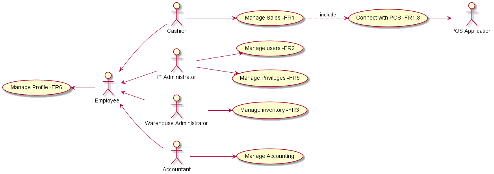

# Requirements Document 

Authors: Yasser Hobballah,Giorgio Rasetto, Simone Pistilli

Date: 21 April 2021

Version: 1.0

# Contents

- [Essential description](#essential-description)
- [Stakeholders](#stakeholders)
- [Context Diagram and interfaces](#context-diagram-and-interfaces)
	+ [Context Diagram](#context-diagram)
	+ [Interfaces](#interfaces) 
	
- [Requirements Document](#requirements-document)
- [Contents](#contents)
- [Essential description](#essential-description)
- [Stakeholders](#stakeholders)
- [Context Diagram and interfaces](#context-diagram-and-interfaces)
	- [Context Diagram](#context-diagram)
	- [Interfaces](#interfaces)
- [Stories and personas](#stories-and-personas)
- [Functional and non functional requirements](#functional-and-non-functional-requirements)
	- [Functional Requirements](#functional-requirements)
	- [Non Functional Requirements](#non-functional-requirements)
- [Use case diagram and use cases](#use-case-diagram-and-use-cases)
	- [Use case diagram](#use-case-diagram)
		- [Use case 1, UC1 - Manage Sales](#use-case-1-uc1---manage-sales)
				- [Scenario 1.1](#scenario-11)
				- [Scenario 1.2](#scenario-12)
				- [Scenario 1.3](#scenario-13)
				- [Scenario 1.4](#scenario-14)
				- [Scenario 1.5](#scenario-15)
				- [Scenario 1.6](#scenario-16)
		- [Use case 2, UC2 - Create an Account](#use-case-2-uc2---create-an-account)
				- [Scenario 2.1](#scenario-21)
		- [Use case 3, UC3 - Modify an Account](#use-case-3-uc3---modify-an-account)
				- [Scenario 3.1](#scenario-31)
				- [Scenario 3.2](#scenario-32)
				- [Scenario 3.3](#scenario-33)
		- [Use case 4, UC4 - Delete an Account](#use-case-4-uc4---delete-an-account)
				- [Scenario 4.1](#scenario-41)
		- [Use case 5, UC5 - Search an Account](#use-case-5-uc5---search-an-account)
				- [Scenario 5.1](#scenario-51)
				- [Scenario 5.2](#scenario-52)
		- [Use case 6, UC6 - Issue an Order](#use-case-6-uc6---issue-an-order)
				- [Scenario 6.1](#scenario-61)
				- [Scenario 6.2](#scenario-62)
				- [Scenario 6.3](#scenario-63)
		- [Use case 7, UC7 - Add/Delete inventory Items](#use-case-7-uc7---adddelete-inventory-items)
				- [Scenario 7.1](#scenario-71)
				- [Scenario 7.2](#scenario-72)
		- [Use case 8, UC8 - Issue Threshold Warning](#use-case-8-uc8---issue-threshold-warning)
				- [Scenario 8.1](#scenario-81)
				- [Scenario 8.2](#scenario-82)
		- [Use case 9, UC9 - Checking income/expenses](#use-case-9-uc9---checking-incomeexpenses)
				- [Scenario 9.1](#scenario-91)
		- [Use case 10, UC7 - Setting prices of items](#use-case-10-uc7---setting-prices-of-items)
				- [Scenario 10.1](#scenario-101)
				- [Scenario 10.2](#scenario-102)
		- [Use case 11, UC7 - Manage Profile (log in)](#use-case-11-uc7---manage-profile-log-in)
				- [Scenario 11.1](#scenario-111)
		- [Use case 12, UC7 - Manage Profile (log out)](#use-case-12-uc7---manage-profile-log-out)
				- [Scenario 12.1](#scenario-121)
- [Glossary](#glossary)
- [System Design](#system-design)
- [Deployment Diagram](#deployment-diagram)

# Essential description

Small shops require a simple application to support the owner or manager. A small shop (ex a food shop) occupies 50-200 square meters, sells 500-2000 different item types, has one or a few cash registers 
EZShop is a software application to:
* manage sales
* manage inventory
* manage customers
* support accounting


# Stakeholders


| Stakeholder name  | Description | 
| ----------------- |:-----------:|
|   Customer 	    |  Buys items from the shop, with or without fidelity card (fidelity card gives Discount).          | 
| 	Cashier			| Use Application to Manage Sales and customers (fidelity Card-register customers),check item prices and availablity. 
|	IT Administrator	| Manages the application, Supervise and Maintain it.
|	Owner			| Funds the developement,operation,maintenance of the Software application and optimizing it and waits for return on investment.
|	Warehouse Administrator | Manages the inventory, sees if a certain product is below a certain threshold and issue an order to supplier. ( Insert,modify and delete items in the inventory)
|	Supplier		| Supplies the shop with items.
|	POS Application | It Handles sales with credit card.
|	Accountant		| Uses the application to manage accounting (Manage income,expenses...).
|	BarCode Reader		| Scans Barcodes on the Items.
# Context Diagram and interfaces

## Context Diagram

```
@startuml

left to right direction
actor :Cashier: as c
actor :IT Administrator: as it
actor :Warehouse Administrator: as wa
actor :Accountant: as a
actor :POS Application: as pos
actor :Employee : as em
actor :barcode : as b
rectangle System {
  usecase "EZShop" AS E
}

c -up- E
it -right- E
wa -down- E
a -down- E
pos -up- E
em -up- E
b --> E 
@enduml
```

## Interfaces


| Actor | Logical Interface | Physical Interface  |
| ------------- |:-------------:| 	-----:|
|   Cashier     | GUI			| Touch Screen Keyboard mouse on PC |
|	IT Administrator|GUI		| Screen Keyboard mouse cable connection on PC |
|	Warehourse Adminstrator|GUI | Screen Keyboard mouse on PC |
|	Accountant |GUI			| Screen Keyboard mouse on PC |
|	POS Application|  service API( Data exchanged...) | Wireless or cable 
| Employee | GUI |  Screen Keyboard mouse on PC
|	BarCode Reader | Wireless Barcode Scanner Interface	| USB Scanner

# Stories and personas


Antonio is 33, works as a Cashier in a minimarket, He works for 9 hours per day. He isnot the only one to work as a cashier there is also his collegues that go into shifts and they all sometimes share cash registers. He finds simple technology better and easier to learn. For this reason, he prefers to use simple system for managing sales.

Simone is 25, works as a Cashier, He works for part-time. And he also studies at the same time plus he prefers to keep everything smooth when dealing with customers. He mainly prefers to have a fast system so that he could search for items and serve customers as fast as possible.

Davide is 40, works at the IT Adminstration part of the shop. He has to manage several systems and application over different shops.He prefers having a dashboard for faster and easier checking of system performance. So he could graphical view and manage different shops easily. 

Francesca is 30, who is a mother of 3 children. She struggles to find balance between job and raising children she would want to be able manage inventories and issues orders more efficiently. Since she isnot 24/7 available ,Her main interset is to have an automatic reordering system that is set to automatically issue order to supplier when an item is below threshold, and she can check afterwards for correctness of order.

Emma is 32 and she is the owner of many shop. She doesn't have technical and computer skills. She rarely get into the technical details of stuff, and want to keep things as simple as possible. She as a owener of the shop, prefers to Check income and expenses by herself using certain straightforward GUI.


# Functional and non functional requirements

## Functional Requirements


| ID        | Description  |
| ------------- |:-------------:| 
| FR1    		| Manage Sales		| <!-- Cashier -->
| FR1.1    		| Start sale transaction	| 
| FR1.2    		| Update sale transaction	|
 | FR1.2.1    	| Add a new item		| 
 | FR1.2.2    	| Delete an item		| 
 | FR1.2.3    	| Scan a Coupon		| 
| FR1.2.4    	| Scan a fidelity card (Points added to card)	| 
| FR1.3    		| Connect with POS service	| 
| FR1.4   		| End Sale transaction	| 
| FR2       	| Manage users		| <!-- IT admin -->
| FR2.1    		| 	Create an account or modify (for an employee)	| 
| FR2.2    		| 	Delete an account	| 
| FR2.3    		| 	Search or List accounts 	|
| FR3 			| Manage inventory 	| <!-- Warehouse admin -->
| FR3.1    		| issue an order (manual)	| 
| FR3.2    		| issue an order (automatic)	|
| FR3.3    		| Add items to the inventory	| 
| FR3.4    		| Delete items to the inventory	| 
| FR3.5    		| Issue a threshold warning | 
| FR4			| Manage Accounting | <!-- Accountant -->
| FR4.1    		| Checking income/expenses	(daily-monthly..)	| 
| FR4.2			| Setting the prices of items | 
| FR5 			| Manage Privileges, Each Employee has specific authorized access rights | <!-- IT admin -->
 | FR6			| Manage Profile  |   <!-- Employee -->
| FR6.1			| Log In  |  
| FR6.2			| Log Out  | 
 

## Non Functional Requirements

\<Describe constraints on functional requirements>

| ID        | Type (efficiency, reliability, ..)           | Description  | Refers to |
| ------------- |:-------------:| :-----:| -----:|
|  NFR1     | Usability   | View a dashboard | FR3 and FR4 |
|  NFR2     | Performance | All functions must be executed < 0.5 sec  | All FR |
|  NFR3     | Portability | The application is able to run on different operating systems (Android-Windows ... )| All FR|
|  NFR4     | Security | Ability to login to each account with special credientials that private  | FR 6 |
|  NFR5     | Percision | The application is able to deal with prices at a precision up to 2 decimal points  | FR1 and FR4 |
|  NFR6     | Usability |  The software is flexible to be used with all different users| All FR |

# Use case diagram and use cases


## Use case diagram



```
@startuml

left to right direction
actor :Cashier: as c
actor :IT Administrator: as it
actor :Warehouse Administrator: as wa
actor :Accountant: as a
actor :POS Application: as pos
actor :Employee : as em

usecase "Manage users -FR2" AS E1
usecase "Manage Privileges -FR5" AS E2
usecase "Manage Sales -FR1" AS E3
usecase "Connect with POS -FR1.3" AS E4
usecase "Manage Accounting" AS E5
usecase "Manage Profile -FR6" AS E6
usecase "Manage inventory -FR3" AS E7


it --> E1
it --> E2
c --> E3
wa --> E7
a --> E5
E6 <-- em
E4 --> pos
E3 ..> E4: include
em <-- it
em <-- c
em <-- a
em <-- wa


@enduml
```
<!-- This is the second part of usecase diagram related to FRs and there subsections-->
```
@startuml

left to right direction

usecase "Manage Sales" AS E1
usecase "Start Sale" AS E2
usecase "Connect with POS" AS E3
usecase "Update Sale" AS E4
usecase "End Sale" AS E5

usecase "Manage inventory" AS E6
usecase "Issue Order -Manual" AS E7
usecase "Issue Order -Automatic" AS E8
usecase "Add Items" AS E9
usecase "Delete Items" AS E10
usecase "Issue threshold warning" AS E11

usecase "Manage Users" AS E12
usecase "List Accounts" AS E13
usecase "Search Accounts" AS E14
usecase "Delete Accounts" AS E15
usecase "Create Account" AS E16

usecase "Manage Accounting" AS E17
usecase "Checking income-expenses" AS E18
usecase "Setting Prices" AS E19

usecase "Manage Profile" AS E20
usecase "Log in" AS E21
usecase "Log out" AS E22

E1 ..> E2: <<include>>
E1 ..> E3: <<include>>
E1 ..> E4: <<include>>
E1 ..> E5: <<include>>
E6 ..> E7: <<include>>
E6 ..> E8: <<include>>
E6 ..> E9: <<include>>
E6 ..> E10: <<include>>
E6 ..> E11: <<include>>
E12 ..> E13: <<include>>
E12 ..> E14: <<include>>
E12 ..> E15: <<include>>
E12 ..> E16: <<include>>
E17 ..> E18: <<include>>
E17 ..> E19: <<include>>
E20 ..> E21: <<include>>
E20 ..> E22: <<include>>

@enduml
```

### Use case 1, UC1 - Manage Sales
| Actors Involved        | Cashier  |
| ------------- |:-------------:| 
|  Precondition     | Account Does Exist so he can login, At least one item exist for checkout |
|  Post condition     |  Transaction Ended, Everything Recorded in the system (stored) |
|  Nominal Scenario     | The Cashier scans all the items and add them to the Bill, Then the customer payment is Done (credit card number correct - Amount is enough ...) |
|  Variants     |  The Cashier scans Fidelity Card of registered customers and offer a certain Discount on the total amount |
|  Variants     | The Customer prefers to pay through Cash-CreditCard |

##### Scenario 1.1 


| Scenario 1.1 | Correct Payment of items with Cash |
| ------------- |:-------------:| 
|  Precondition     | Account Does Exist so Cashier can login, At least one item exist for checkout |
|  Post condition     | Transaction Completed, Everything is recorded in the system (stored) |
| Step#        | Description  |
|  1     | Start Sale transaction|  
|  2     | Cashier Scans One Item |  
|  3     | The item price is added to the Total amount  |
|        | Repeat 2 and 3 for all other items  |
|  4     | The Cashier closes the Bill |
|  5     | The Customer pays the Bill using Cash |
|  6    | End Sale transaction|
##### Scenario 1.2
| Scenario 1.2 | Correct Payment of items with Credit Card |
| ------------- |:-------------:| 
|  Precondition     | Account Does Exist so Cashier can login, At least one item exist for checkout, Connection with POS is Done |
|  Post condition     | Transaction Completed, Everything is recorded in the system (stored) |
| Step#        | Description  |
|  1     | Start Sale transaction|  
|  2     | Cashier Scans One Item |  
|  3     | The item price is added to the Total amount  |
|        | Repeat 2 and 3 for all other items  |
|  4     | The Cashier closes the Bill |
|  5     | The Customer pays the Bill using credit Card |
|  6     | End Sale transaction|

##### Scenario 1.3
| Scenario 1.3 | Customer No Sufficient Funds |
| ------------- |:-------------:| 
|  Precondition     | Account Does Exist so Cashier can login, At least one item exist for checkout|
|  Post condition     | Transaction Aborted |
| Step#        | Description  |
|  1     | Start Sale transaction|  
|  2     | Cashier Scans One Item |  
|  3     | The item price is added to the Total amount  |
|        | Repeat 2 and 3 for all other items  |
|  5     | The Cashier closes the Bill |
|  5     | The Customer have no enough funds to pay |
|  6     | Abort Sale transaction |

##### Scenario 1.4
| Scenario 1.4 | Fidelity Card Discount |
| ------------- |:-------------:| 
|  Precondition     | Account Does Exist so Cashier can login, At least one item exist for checkout, Connection with POS is Done  |
|  Post condition     | Transaction Completed, Everything is recorded in the system (stored), Fidelity Card updated  |
| Step#        | Description  |
|  1     | Start Sale transaction|  
|  2     | Cashier scans the fidelity Card |  
|  3     | Cashier Scans One Item |  
|  4     | The item price is added to the Total amount  |
|        | Repeat 3 and 4 for all other items  |
|  5     | The Cashier closes the Bill |
|  6     | The Customer pays using creditcard or cash |
|  7     | End Sale transaction |
|  8     | Number of points are added to fidelity card |

##### Scenario 1.5
| Scenario 1.5 | Coupon  |
| ------------- |:-------------:| 
|  Precondition     | Account Does Exist so Cashier can login, At least one item exist for checkout,Connection with POS is Done|
|  Post condition     | Transaction Completed, Everything is recorded in the system (stored) |
| Step#        | Description  |
|  1     | Start Sale transaction|  
|  2     | Cashier Scans One Item |  
|  3     | The item price is added to the Total amount  |
|        | Repeat 2 and 3 for all other items  |
|  4     | The Cashier closes the Bill |
|  5     | Cashier scans the Coupon |  
|  6     | Bill amount is decreased by coupon amount|  
|  7     | The Customer pays using creditcard or cash |
|  8     | End Sale transaction  |

##### Scenario 1.6
| Scenario 1.5 | Delete an item  |
| ------------- |:-------------:| 
|  Precondition     | Account Does Exist so Cashier can login, At least one item exist for checkout,Connection with POS is Done |
|  Post condition     | Transaction Completed, Everything is recorded in the system (stored) |
| Step#        | Description  |
|  1     | Start Sale transaction|  
|  2     | Cashier Scans One Item |  
|  3     | The item price is added to the Total amount  |
|        | Repeat 2 and 3 for all other items  |
|  4     | Delete an item | 
|  5     | The Cashier closes the Bill |
|  6     | The Customer pays the Bill using Cash or credit card |
|  7    | End Sale transaction |

### Use case 2, UC2 - Create an Account 
| Actors Involved        | IT Administrator |
| ------------- |:-------------:|  
|  Precondition     | The IT administrator accesses to his profile, the account U does not exist |
|  Post condition     | The account U is added in the system |
|  Nominal Scenario     | The IT administrator create a new account for an employee, setting the personal data |
|  Variants     | --- |

##### Scenario 2.1
| Scenario 2.1 | Correct creation |
| ------------- |:-------------:| 
|  Precondition     | The IT administrator accesses to his profile, the account U does not exist |
|  Post condition     | The account U is added in the system |
| Step#        | Description  |
|  1     | The IT Administrator start the creation |  
|  2     | The IT Administrator compile all the fields of the form |  
|  3     | An ID and a password are generated automatically by the software |
|  4     | The Account is added to the system |
|  5     | The creation of the account ends |


### Use case 3, UC3 - Modify an Account
| Actors Involved        | IT Administrator |
| ------------- |:-------------:|  
|  Precondition     | The IT administrator accesses to his profile, the account U exists |
|  Post condition     | The account U is modified in the system |
|  Nominal Scenario     | The IT administrator modify an existing account for an employee, setting the personal data |
|  Variants     | If a password is lost, he could generate a new one |

##### Scenario 3.1
| Scenario 3.1 | Modification of personal data |
| ------------- |:-------------:| 
|  Precondition     | The IT administrator accesses to his profile, the account U exists |
|  Post condition     | The account U is modified in the system |
|  Step#        | Description  |
|  1     | The IT Administrator opens account U |  
|  2     | The IT Administrator modifies the fields of the form |  
|  3     | The Account is modified in the system |
|  4     | The modification of the account ends |

##### Scenario 3.2
| Scenario 3.2 | Password reset |
| ------------- |:-------------:| 
|  Precondition     | The IT administrator accesses to his profile, the account U exists |
|  Post condition     | The account U is modified in the system |
|  Step#        | Description  |
|  1     | The IT Administrator opens account U |  
|  2     | The IT Administrator generate automatically a new password for the account U |  
|  3     | The new password is set |
|  4     | The modification of the account ends |


##### Scenario 3.3
| Scenario 3.3 | Privileges Change |
| ------------- |:-------------:| 
|  Precondition     | The IT administrator accesses to his profile, the account U exists |
|  Post condition     | The account U is modified in the system |
|  Step#        | Description  |
|  1     | The IT Administrator opens account U |  
|  2     | The IT Administrator Changes User's U Privileges |  
|  3     | The modification of the account ends |


### Use case 4, UC4 - Delete an Account
| Actors Involved        | IT Administrator |
| ------------- |:-------------:|  
|  Precondition     | The IT administrator accesses to his profile, the account U exists |
|  Post condition     | The account U is deleted in the system |
|  Nominal Scenario     | The IT administrator eliminates an existing account of an employee, removing the personal data |
|  Variants     | --- |

##### Scenario 4.1
| Scenario 4.1 | Account removed |
| ------------- |:-------------:| 
|  Precondition     | The IT administrator accesses to his profile, the account U exists |
|  Post condition     | The account U is deleted in the system |
|  Step#        | Description  |
|  1     | The IT Administrator opens account U |  
|  2     | The IT Administrator remove the account from the system |  
|  3     | All data are removed |
|  4     | The elimination of the account ends |

### Use case 5, UC5 - Search an Account
| Actors Involved        | IT Administrator |
| ------------- |:-------------:|  
|  Precondition     | The IT administrator accesses to his profile, at least one account exists |
|  Post condition     | An output is displayed (Account if exists) |
|  Nominal Scenario     | The IT administrator search an existing account of an employee |
|  Variants     | An account could exist or not |
|  Variants   	| List all accounts |

##### Scenario 5.1
| Scenario 5.1 | Account found |
| ------------- |:-------------:| 
|  Precondition     | The IT administrator accesses to his profile, the account U exists |
|  Post condition     | The account searched is displayed |
|  Step#        | Description  |
|  1     | The IT Administrator opens the search window and all accounts listed |  
|  2     | The IT Administrator search a specific ID |  
|  3     | The account searched is displayed |

##### Scenario 5.2
| Scenario 5.2 | Account not found |
| ------------- |:-------------:| 
|  Precondition     | The IT administrator accesses to his profile, the account U does not exist |
|  Post condition     | The account searched is displayed |
|  Step#        | Description  |
|  1     | The IT Administrator opens the search window and all accounts listed |  
|  2     | The IT Administrator search a specific ID | 
|  3     | A 'not found' message is displayed |


### Use case 6, UC6 - Issue an Order
| Actors Involved  | Warehouse administrator |
| ------------- |:-------------:|  
|  Precondition     | The warehouse administrator accesses to his profile (Account Exists) |
|  Post condition     | The order is added into the system |
|  Nominal Scenario     | The warehouse administrator creates a new order's istance in the system. |
|  Variants     | If the order changes warehouse administrator have to modify that in the system. |

##### Scenario 6.1
| Scenario 6.1 | Warehouse administrator add an order to the system |
| ------------- |:-------------:| 
|  Precondition     | The warehouse administrator accesses to his profile |
|  Post condition     | The order is added in the system |
|  Step#        | Description  |
|  1     | The warehouse administrator opens the form where he can add new orders |  
|  2     | The warehouse administrator upload the order|  
|  3     | The warehouse administrator adds the order to the order list (Manual)|
|  4     | The adding process of the order ends |

##### Scenario 6.2
| Scenario 6.2 | Warehouse administrator have to change a preexisting order |
| ------------- |:-------------:| 
|  Precondition     | The warehouse administrator accesses to his profile, the order exists |
|  Post condition     | The order is updated |
|  Step#        | Description  |
|  1     | The warehouse administrator opens the form where he can uploads the order |  
|  2     | The warehouse administrator uploads the new order |  
|  3     | The modifing process of the order ends |

##### Scenario 6.3
| Scenario 6.3 | The application automatically add an order to the system |
| ------------- |:-------------:| 
|  Precondition     | The warehouse administrator accesses to his profile, Warehouse administrator sets automatic ordering when Threshold is Reached |
|  Post condition     | The order is added in the system   |
|  Step#        | Description  | 
|  1    | The Threshold is reached  |  
|  2    | The ordered is issued automatically  |  


### Use case 7, UC7 - Add/Delete inventory Items

| Actors Involved  | Warehouse administrator |
| ------------- |:-------------:|  
|  Precondition     | The warehouse administrator accesses to his profile |
|  Post condition     | The item is added/deleted in the system |
|  Nominal Scenario     | The warehouse administrator creates a new item's istance in the system. |
|  Variants     | If the item charateristics changes warehouse administrator have to modify that in the system. |

##### Scenario 7.1
| Scenario 7.1 | Warehouse administrator add an item to the system |
| ------------- |:-------------:| 
|  Precondition     | The warehouse administrator accesses to his profile |
|  Post condition     | The item is added/deleted in the system |
|  Step#        | Description  |
|  1     | The warehouse administrator opens the form where can add new items |  
|  2     | The warehouse administrator modifies the fields of the form |  
|  3     | The warehouse administrator adds the item to the item list|
|  4     | The item's adding process ends |

##### Scenario 7.2
| Scenario 7.2 | Warehouse administrator have to change a preexisting item |
| ------------- |:-------------:| 
|  Precondition     | The warehouse administrator accesses to his profile, the item exists |
|  Post condition     | The item is updated |
|  Step#        | Description  |
|  1     | The warehouse administrator opens the form where can modify the item |  
|  2     | The warehouse administrator modifies the fields of the form |  
|  3     | The warehouse administrator update the item |
|  4     | The item modifing process ends |


### Use case 8, UC8 - Issue Threshold Warning

| Actors Involved  | Warehouse administrator |
| ------------- |:-------------:|  
|  Precondition     | The warehouse administrator accesses to his profile |
|  Post condition     | The threshold warning is issued |
|  Nominal Scenario     | The warehouse administrator creates a new threshold warning. |
|  Variants     | If the threshold changes warehouse administrator have to modify that in the system. If the the item onto warehouse administrator want to add the threshold warning does not exists, he have to add it |

##### Scenario 8.1
| Scenario 8.1 | Warehouse administrator add a threshold warning to the system |
| ------------- |:-------------:| 
|  Precondition     | The warehouse administrator accesses to his profile |
|  Post condition     | The threshold warning is added |
|  Step#        | Description  |
|  1     | The warehouse administrator opens the form where can add new threshold warning |  
|  2     | The warehouse administrator modifies the fields of the form |  
|  3     | The warehouse administrator adds the threshold warning to the warning list|
|  4     | The warning's adding process ends |

##### Scenario 8.2
| Scenario 8.2 | Warehouse administrator have to change a preexisting warning |
| ------------- |:-------------:| 
|  Precondition     | The warehouse administrator accesses to his profile, the warning exists |
|  Post condition     | The warning is updated |
|  Step#        | Description  |
|  1     | The warehouse administrator opens the form where he can modify the warning |  
|  2     | The warehouse administrator modifies the fields of the form |  
|  3     | The warehouse administrator update the warning |
|  4     | The warning's modifing process ends |


### Use case 9, UC9 - Checking income/expenses
| Actors Involved    | Accountant  |
| ------------- |:-------------:|  
|  Precondition     | Employee(Accountant) Account Exists |
|       			|Recorded Daily Sales Transactions is stored for the accountant to access|
|       			|Amount of Expenses is stored (items supplier-Electricity-...) |
|  Post condition    | Profit is Calculated (From the income and Expense difference)  |
|  Nominal Scenario  | The Accountant lists items sold and there Expense of ordering them from the supplier, and the profit is calculated per item sold, then additional Expenses are added at last |
|  Variants     | --- |


##### Scenario 9.1
| Scenario 9.1 | Calculate Profit |
| ------------- |:-------------:| 
|  Precondition     | Accountant has a valid Account |
|       			|Recorded Daily Sales Transactions is stored for the accountant to access|
|       			|Amount of Expenses is stored (items supplier-Electricity-...) |
|  Post condition    | Profit is Calculated (From the income and Expense difference)  |
| Step#        | Description  |
|  1     | The Accountant list item sold |  
|  2     | The Accountant list item expense when ordered from supplier |  
|  3     | The Accountant calculates profit by simple (price sold - Expense per item)  |
|        | repeat 2 and 3 for each item sold on that day |
|  4     | The total profit and Expense is calculated  |
|  5     | Additional Expenses are added to the Total Expense |
|  6     | Final Profit is calculated taking into account Additional Expenses |

### Use case 10, UC7 - Setting prices of items
| Actors Involved    | Accountant  |
| ------------- |:-------------:|  
|  Precondition     | Accountant has a Valid Account, The List of order items from the Supplier is available   |
|  Post condition     | Each item order from the Supplier has a set price on it to be sold in shop   |
|  Nominal Scenario     | The Accountant receives the list of items arrived from the Supplier and sets price for item according to a certain profit threshold (Ex: 10%-20% profit)|
|  Variants     |  The Accountant receives the list of items ordered from the supplier and the ordered items have already a set price in the shop, so no need to set a new price for such items |

##### Scenario 10.1
| Scenario 10.1 | Set price |
| ------------- |:-------------:| 
|  Precondition     | Account has a Valid Account, The List of order items from the Supplier is available   |
|  Post condition    | Each item order from the Supplier has a set price on it to be sold in shop  |
| Step#        | Description  |
|  1     | The Accountant receives list of items arrived from the supplier |  
|  2     | We Define a Profit threshold for each item |  
|  3     | The Accountant sets the price of each item according to a Predefined Profit threshold |  
|  4     | Items now are added to the inventory to be sold in the shop | 

##### Scenario 10.2
| Scenario 10.2 | Set price |
| ------------- |:-------------:| 
|  Precondition     | Account has a Valid Account, The List of order items from the Supplier is available   |
|  Post condition    | Each item order from the Supplier has a set price on it to be sold in shop  |
| Step#        | Description  |
|  1     | The Accountant receives list of items arrived from the supplier |  
|  2     | We Define a Profit threshold for each item | 
|  3     | The Ordered items has already preCalculated price set, no need to set new price |  
|  4     | Items now are added to the inventory to be sold in the shop | 

### Use case 11, UC7 - Manage Profile (log in)
| Actors Involved    | Employee  |
| ------------- |:-------------:|  
|  Precondition     |  Account Exists |
|  Post condition     |  The Employee accesses his profile  |
|  Nominal Scenario     | The Employee Enters his credentials (i.e username and password ), Then he is able to login into his personal account with his information bound to it |
|  Variants     | The Employee forgets his credentials so he must contact the It Admin for recovery to log in   |


##### Scenario 11.1
| Scenario 11.1 | Set price |
| ------------- |:-------------:| 
|  Precondition     |  Account Exists   |
|  Post condition    | The Employee accesses his profile  |
| Step#        | Description  |
|  1     | The Employee enters the login interface |  
|  2     | The Employee enters the username and password  | 

### Use case 12, UC7 - Manage Profile (log out)
| Actors Involved    | Employee  |
| ------------- |:-------------:|  
|  Precondition     |  Account Exists,The Employee accesses his profile |
|  Post condition     |  The Employee logout of account  |
|  Nominal Scenario     | The Employee Press Logout |
|  Variants     | -- |


##### Scenario 12.1
| Scenario 12.1 | Set price |
| ------------- |:-------------:| 
|  Precondition     | Account Exists,The Employee accesses his profile   |
|  Post condition    | The Employee logout of account  |
| Step#        | Description  |
|  1     | The Employee press the Logout Button |  


# Glossary


```
@startuml

title : EzShop

class EzShop {}
class Employee{
    ID
    Account_pass
    Name
}

class POS{}

class Sale_Transaction{
    Amount
    Credit Card or Cash
    Date
}
class Customer{}

class Fidelity_Card{
     ID
     Amount of points
}

class Cashier{}
class CashResgister{}
class Coupon{
    Discount price
}
class IT_Administrator{}
class Accountant{}
class Price_List{
     Item Price
      Currency
}
class Warehouse_Administrator{}

class Inventory{}
class Items{
     Name
     ID
}
class Order {
     Order Price
}
class Supplier {}

note top of POS: POS is an External Payment Gateway
note top of Cashier: Manage Sales with Customer
note top of Fidelity_Card: Store gift points for Customers with fidelity card
note top of IT_Administrator: Manage Employee Accounts and privileges
note top of Accountant: Set Prices, Checks income/expense
note top of Warehouse_Administrator: Lists,Searches items and Manage inventory

EzShop -- "*"Employee
Cashier --> Employee
IT_Administrator --> Employee
Accountant --> Employee
Warehouse_Administrator--> Employee
Cashier -- CashResgister
CashResgister -- "1"POS
Cashier -- "*"Sale_Transaction: issues
Sale_Transaction "*" -- Customer
Sale_Transaction "*" -- Coupon
Sale_Transaction "*" -- Accountant
Customer -- "0..1"Fidelity_Card: Have
Accountant -- "*"Order
Accountant -- Price_List: sets Price
Price_List -- "*"Items: Have
Warehouse_Administrator -- Inventory
Warehouse_Administrator -- "*"Order: Issues
Inventory -- "*"Items
Order -- "*"Items
Order"*"--Supplier


@enduml
```
\<concepts are used consistently all over the document, ex in use cases, requirements etc>

# System Design

Only Software Components are Considered.


# Deployment Diagram 

```
@startuml

left to right direction
node PC
node EzShop_Server
artifact EzShop_Application
artifact EzShop_Backend

PC"*" -- EzShop_Server: Lan Link
EzShop_Application ..> PC:deploy
EzShop_Backend ..> EzShop_Server:deploy

@enduml
```

