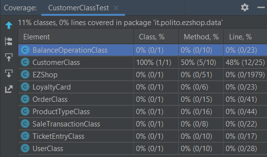
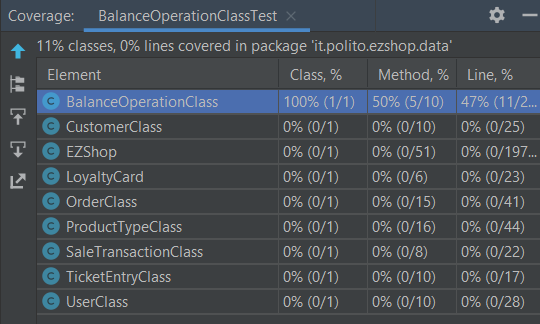
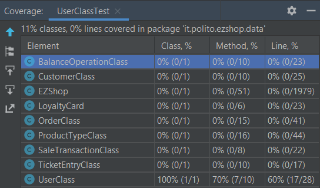
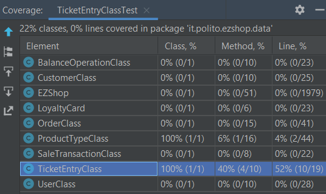
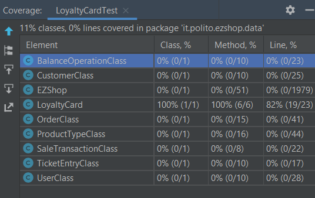
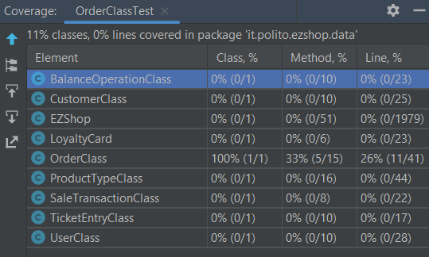
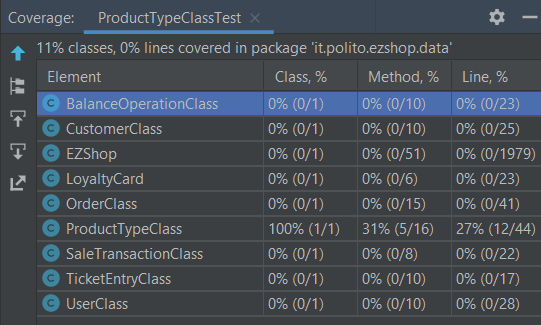

# Unit Testing Documentation

Authors: Yasser Hobballah, Giorgio Rasetto, Simone Pistilli

Date: 19 May 2021

Version: 1.0

# Contents

- [Black Box Unit Tests](#black-box-unit-tests)

- [White Box Unit Tests](#white-box-unit-tests)

# Black Box Unit Tests

    <Define here criteria, predicates and the combination of predicates for each function of each class.
    Define test cases to cover all equivalence classes and boundary conditions.
    In the table, report the description of the black box test case and (traceability) the correspondence with the JUnit test case writing the 
    class and method name that contains the test case>
    <JUnit test classes must be in src/test/java/it/polito/ezshop   You find here, and you can use,  class TestEzShops.java that is executed  
    to start tests
    >

 ### **Class *CustomerClass* - method *setCustomerName***
<!---------------------------------------Example CustomerClass TEST----------------------------------------------->
 

**Criteria for method *setCustomerName*:**
	

 - Validity of String Parameter
 - Length of the String

**Predicates for method *setCustomerName*:**

| Criteria | Predicate |
| -------- | --------- |
| Validity of the String Parameter     |   Valid        |
|          |      NULL     |
|     Length of the String     |   >0        |
|          |      = 0 ("")     |

**Boundaries**:

| Criteria | Boundary values |
| -------- | --------------- |
|          |                 |
|          |                 |

<!--
**Combination of predicates**:

| Criteria 1 | Criteria 2 | ... | Valid / Invalid | Description of the test case | JUnit test case |
|-------|-------|-------|-------|-------|-------|
|||||||
|||||||
|||||||
|||||||
|||||||
-->

**Combination of predicates**:

|  Validity of the String Parameter | Length of the String  | Valid / Invalid | Description of the test case | JUnit test case |
|-------|-------|-------|-------|-------|
| Valid | >0 | Valid | customername="Mario" -> Name assigned succesfully | testValidCustomerName() |
| " | 0 | Invalid | customername="" -> name not assigned | testInvalidCustomerName()|
| NULL | * | Invalid | customername= null -> name not assigned | testNullCustomerName()|

<!--------------------------------------- SetID  ----------------------------------------------->
 ### **Class *CustomerClass* - method *setId***

 

**Criteria for method *setId*:**
	

 - Sign of ID
 - Validity of ID

**Predicates for method *setId*:**

| Criteria | Predicate |
| -------- | --------- |
| Sign of ID     |    <= 0    |
|          |      > 0     |
| Validity of ID    |   Valid       |
|          |      NULL    |

**Boundaries**:

| Criteria | Boundary values |
| -------- | --------------- |
|     Sign of ID    |       0       |

**Combination of predicates**:

|  Validity of ID | Sign of ID  | Valid / Invalid | Description of the test case | JUnit test case |
|-------|-------|-------|-------|-------|
| Valid | > 0 | Valid | id= 1 -> id assigned succesfully | testValidCustomerID()|
| " | < = 0 | Invalid | id= 0 -> id not assigned | testInvalidCustomerID()|
| NULL | * | Invalid | id= null -> id not assigned | testNullCustomerID()|

<!---------------------------------------END CustomerClass TEST----------------------------------------------->
<!---------------------------------------BalanceOperation TEST----------------------------------------------->

<!--------------------------------------- setBalanceId  ----------------------------------------------->
 ### **Class *BalanceOperationClass* - method *setBalanceId***

 

**Criteria for method *setBalanceId*:**
	

 - Sign of ID
 - Validity of ID

**Predicates for method *setBalanceId*:**

| Criteria | Predicate |
| -------- | --------- |
| Sign of ID     |    <= 0    |
|          |      > 0     |
| Validity of ID    |   Valid       |
|          |      NULL    |

**Boundaries**:

| Criteria | Boundary values |
| -------- | --------------- |
|     Sign of ID    |       0       |

**Combination of predicates**:

|  Validity of ID | Sign of ID  | Valid / Invalid | Description of the test case | JUnit test case |
|-------|-------|-------|-------|-------|
| Valid | > 0 | Valid | Balanceid= 1 -> id assigned succesfully | testValidBalanceID()|
| " | < = 0 | Invalid | Balanceid = 0 -> id not assigned | testInvalidBalanceID()|
| NULL | * | Invalid | Balanceid = null -> id not assigned | testInvalidBalanceID()|

<!--------------------------------------- setType  ----------------------------------------------->
 ### **Class *BalanceOperationClass* - method *setType***

 

**Criteria for method *setType*:**
	

- Validity of String Parameter
- Length of the String
- Validity of Type

**Predicates for method *setType*:**

| Criteria | Predicate |
| -------- | --------- |
| Validity of the String Parameter     |   Valid        |
|          |      NULL     |
|     Length of the String     |   >0        |
|          |      = 0 ("")     |
| Validity of Type   |   = "CREDIT" || = "DEBIT" || = "SALE" || = "RETURN"      |
|          |      != "CREDIT" && != "DEBIT" && != "SALE" && != "RETURN"     |

**Boundaries**:

| Criteria | Boundary values |
| -------- | --------------- |
|          |                 |
|          |                 |

**Combination of predicates**:

|  Validity of the String Parameter | Length of the String  | Validity of Type | Valid / Invalid | Description of the test case | JUnit test case |
|-------|-------|-------|-------|-------|-------|
| Valid | >0 | "CREDIT" or  "DEBIT" or  "SALE" or  "RETURN" | Valid | type="CREDIT" -> type assigned succesfully | testValidType() |
| " | >0 | not "CREDIT" nor  "DEBIT" nor  "SALE" nor  "RETURN" | Invalid | type="buy" -> type not assigned | testNotValidType() |
| " | 0 | * | Invalid | type="" -> type not assigned | testNullType()|
| NULL | * | * | Invalid | type= null -> type not assigned | testNullType()|

<!---------------------------------------End BalanceOperation TEST----------------------------------------------->
<!---------------------------------------Users TEST----------------------------------------------->

<!--------------------------------------- SetID  ----------------------------------------------->
 ### **Class *UserClass* - method *setId***

 

**Criteria for method *setId*:**
	

 - Sign of ID
 - Validity of ID

**Predicates for method *setId*:**

| Criteria | Predicate |
| -------- | --------- |
| Sign of ID     |    <= 0    |
|          |      > 0     |
| Validity of ID    |   Valid       |
|          |      NULL    |

**Boundaries**:

| Criteria | Boundary values |
| -------- | --------------- |
|     Sign of ID    |       0       |

**Combination of predicates**:

|  Validity of ID | Sign of ID  | Valid / Invalid | Description of the test case | JUnit test case |
|-------|-------|-------|-------|-------|
| Valid | > 0 | Valid | id= 1 -> id assigned succesfully | testValidUserID()|
| " | < = 0 | Invalid | id= 0 -> id not assigned | testInvalidUserID()|
| NULL | * | Invalid | id= null -> id not assigned | testNullUserID()|

<!--------------------------------------- setUserName  ----------------------------------------------->
 ### **Class *UserClass* - method *setUserName***

 

**Criteria for method *setUserName*:**
	

 - Validity of String Parameter
 - Length of the String

**Predicates for method *setUserName*:**

| Criteria | Predicate |
| -------- | --------- |
| Validity of the String Parameter     |   Valid        |
|          |      NULL     |
|     Length of the String     |   >0        |
|          |      = 0 ("")     |

**Boundaries**:

| Criteria | Boundary values |
| -------- | --------------- |
|          |                 |
|          |                 |

**Combination of predicates**:

|  Validity of the String Parameter | Length of the String  | Valid / Invalid | Description of the test case | JUnit test case |
|-------|-------|-------|-------|-------|
| Valid | >0 | Valid | username="Mario" -> Name assigned succesfully | testValidUserName() |
| " | 0 | Invalid | username="" -> name not assigned | testInvalidUserName()|
| NULL | * | Invalid | username= null -> name not assigned | testNullUserName()|

<!--------------------------------------- setrole  ----------------------------------------------->
 ### **Class *UserClass* - method *setrole***

 

**Criteria for method *setrole*:**
	

- Validity of String Parameter
- Length of the String
- Validity of role

**Predicates for method *setrole*:**

| Criteria | Predicate |
| -------- | --------- |
| Validity of the String Parameter     |   Valid        |
|          |      NULL     |
|     Length of the String     |   >0        |
|          |      = 0 ("")     |
| Validity of role   |   = "ShopManager" || = "Administrator" || = "Cashier"     |
|          |      != "ShopManager" && != "Administrator" && != "Cashier"     |

**Boundaries**:

| Criteria | Boundary values |
| -------- | --------------- |
|          |                 |
|          |                 |

**Combination of predicates**:

|  Validity of the String Parameter | Length of the String  | Validity of Type | Valid / Invalid | Description of the test case | JUnit test case |
|-------|-------|-------|-------|-------|-------|
| Valid | >0 | "ShopManager" or  "Administrator" or  "Cashier" | Valid | role="Cashier" -> type assigned succesfully | testValidRole() |
| " | >0 | not "ShopManager" nor  "Administrator" nor  "Cashier"  | Invalid | type="buy" -> type not assigned | testNotValidRole() |
| " | 0 | * | Invalid | type="" -> type not assigned | testNullRole()|
| NULL | * | * | Invalid | type= null -> type not assigned | testNullRole()|

<!---------------------------------------End Users TEST----------------------------------------------->
<!---------------------------------------LoyaltyCard TEST----------------------------------------------->
### **Class *LoyaltyCard* - method *setCardNumber***

**Criteria for method *setCardNumber*:**

- Validity of String Parameter
- Length of the String

**Predicates for method *setCardNumber*:**

| Criteria | Predicate |
| -------- | --------- |
| Validity of the String Parameter     |   Valid        |
|          |      NULL     |
|     Length of the String     |   =10        |
|          |      != 10      |

**Boundaries**:

| Criteria | Boundary values |
| -------- | --------------- |
|          |                 |
|          |                 |

**Combination of predicates**:

|  Validity of the String Parameter | Length of the String  | Valid / Invalid | Description of the test case | JUnit test case |
|-------|-------|-------|-------|-------|
| Valid | =10 | Valid | cardnumber="0123456789" -> cardnumber assigned succesfully | testInvalidCardNumber() |
| " | !=10 | Invalid | cardnumber="123" -> cardnumber not assigned | testInvalidCardNumber()|
| NULL | * | Invalid | username= null -> cardnumber not assigned | testInvalidCardNumber()|

<!--------------------------------------- SetPoints  ----------------------------------------------->
### **Class *LoyaltyCard* - method *setPoints***

**Criteria for method *setPoints*:**

- Sign of points
- Validity of points

**Predicates for method *setPoints*:**

| Criteria | Predicate |
| -------- | --------- |
| Sign of points     |    < 0    |
|          |      >= 0     |
| Validity of points    |   Valid       |
|          |      NULL    |

**Boundaries**:

| Criteria | Boundary values |
| -------- | --------------- |
|     Sign of points    |       0       |

**Combination of predicates**:

|  Validity of ID | Sign of ID  | Valid / Invalid | Description of the test case | JUnit test case |
|-------|-------|-------|-------|-------|
| Valid | > = 0 | Valid | points=0  -> points assigned successfully | testInvalidPoints()|
| " | < 0 | Invalid | points = -1 -> points not assigned | testInvalidPoints()|
| NULL | * | Invalid | points= null -> points not assigned | testInvalidPoints()|

<!---------------------------------------End LoyaltyCard TEST----------------------------------------------->
<!---------------------------------------TicketEntry TEST----------------------------------------------->

<!--------------------------------------- SetAmount  ----------------------------------------------->
### **Class *TicketEntry* - method *setAmount***

**Criteria for method *setAmount*:**

- Sign of Amount
- Validity of amount

**Predicates for method *setAmount*:**

| Criteria | Predicate |
| -------- | --------- |
| Sign of amount     |    < 0    |
|          |      >= 0     |
| Validity of amount    |   Valid       |
|          |      NULL    |

**Boundaries**:

| Criteria | Boundary values |
| -------- | --------------- |
|     Sign of amount    |       0       |

**Combination of predicates**:

|  Validity of amount | Sign of amount  | Valid / Invalid | Description of the test case | JUnit test case |
|-------|-------|-------|-------|-------|
| Valid | > = 0 | Valid | amount=0  -> amount assigned successfully | testInvalidAmount()|
| " | < 0 | Invalid | amount = -1 -> amount not assigned | testInvalidAmount()|
| NULL | * | Invalid | amount= null -> amount not assigned | testInvalidAmount()|

<!--------------------------------------- SetDiscountRate  ----------------------------------------------->
### **Class *TicketEntry* - method *setDiscountRate***

**Criteria for method *setDiscountRate*:**

- Sign of discountRate
- Validity of discountRate

**Predicates for method *setdiscountRate*:**

| Criteria | Predicate |
| -------- | --------- |
| Sign of discountRate     |    < 0    |
|          |      >= 1.0     |
|          |      >= 0.0 && < 1.0     |
| Validity of discountRate    |   Valid       |
|          |      NULL    |

**Boundaries**:

| Criteria | Boundary values |
| -------- | --------------- |
|     low limit    |       0       |
|     high limit    |       1       |

**Combination of predicates**:

|  Validity of discountRate | Sign of discountRate  | Valid / Invalid | Description of the test case | JUnit test case |
|-------|-------|-------|-------|-------|
| Valid | > = 0 && <= 1.0 | Valid | amount=0.5  -> discountRate assigned successfully | testInvalidDiscountRate()|
| " | < 0 | Invalid | amount = -1 -> discountRate not assigned | testInvalidDiscountRate()|
| " | > 1.0 | Invalid | amount = 1.1 -> discountRate not assigned | testInvalidDiscountRate()|
| NULL | * | Invalid | amount= null -> discountRate not assigned | testInvalidDiscountRate()|

<!---------------------------------------End TicketEntry TEST----------------------------------------------->
<!---------------------------------------OrderClass TEST----------------------------------------------->

<!--------------------------------------- setProductCode  ----------------------------------------------->
### **Class *OrderClass* - method *setProductCode***

**Criteria for method *setProductCode*:**

- Validity of String Parameter
- Length of the String

**Predicates for method *setProductCode*:**

| Criteria | Predicate |
| -------- | --------- |
| Validity of the String Parameter     |   Valid        |
|          |      NULL     |
|     Length of the String     |   >0        |
|          |      = 0 ("")     |

**Boundaries**:

| Criteria | Boundary values |
| -------- | --------------- |
|          |                 |
|          |                 |

**Combination of predicates**:

|  Validity of the String Parameter | Length of the String  | Valid / Invalid | Description of the test case | JUnit test case |
|-------|-------|-------|-------|-------|
| Valid | >0 | Valid | productCode="Mario" -> productCode assigned succesfully | testValidProductCode() |
| " | 0 | Invalid | productCode="" -> productCode not assigned | testInvalidProductCode()|
| NULL | * | Invalid | productCode= null -> productCode not assigned | testNullProductCode()|

<!--------------------------------------- SetOrderId  ----------------------------------------------->
### **Class *OrderClass* - method *setOrderId***

**Criteria for method *setOrderId*:**

- Sign of ID
- Validity of ID

**Predicates for method *setOrderId*:**

| Criteria | Predicate |
| -------- | --------- |
| Sign of ID     |    <= 0    |
|          |      > 0     |
| Validity of ID    |   Valid       |
|          |      NULL    |

**Boundaries**:

| Criteria | Boundary values |
| -------- | --------------- |
|     Sign of ID    |       0       |

**Combination of predicates**:

|  Validity of ID | Sign of ID  | Valid / Invalid | Description of the test case | JUnit test case |
|-------|-------|-------|-------|-------|
| Valid | > 0 | Valid | id= 1 -> id assigned succesfully | testValidOrderID()|
| " | < = 0 | Invalid | id= 0 -> id not assigned | testInvalidOrderID()|
| NULL | * | Invalid | id= null -> id not assigned | testNullOrderID()|

<!---------------------------------------End OrderClass TEST----------------------------------------------->
<!---------------------------------------ProductType TEST----------------------------------------------->

<!--------------------------------------- setProductCode  ----------------------------------------------->

### **Class *ProductTypeClass* - method *setProductCode***

**Criteria for method *setProductCode*:**

- Validity of String Parameter
- Length of the String

**Predicates for method *setProductCode*:**

| Criteria | Predicate |
| -------- | --------- |
| Validity of the String Parameter     |   Valid        |
|          |      NULL     |
|     Length of the String     |   >0        |
|          |      = 0 ("")     |

**Boundaries**:

| Criteria | Boundary values |
| -------- | --------------- |
|          |                 |
|          |                 |

**Combination of predicates**:

|  Validity of the String Parameter | Length of the String  | Valid / Invalid | Description of the test case | JUnit test case |
|-------|-------|-------|-------|-------|
| Valid | >0 | Valid | productCode="Mario" -> productCode assigned succesfully | testValidProductCode() |
| " | 0 | Invalid | productCode="" -> productCode not assigned | testInvalidProductCode()|
| NULL | * | Invalid | productCode= null -> productCode not assigned | testNullProductCode()|

<!--------------------------------------- SetOrderId  ----------------------------------------------->
### **Class *ProductType* - method *setId***

**Criteria for method *setId*:**

- Sign of ID
- Validity of ID

**Predicates for method *setId*:**

| Criteria | Predicate |
| -------- | --------- |
| Sign of ID     |    <= 0    |
|          |      > 0     |
| Validity of ID    |   Valid       |
|          |      NULL    |

**Boundaries**:

| Criteria | Boundary values |
| -------- | --------------- |
|     Sign of ID    |       0       |

**Combination of predicates**:

|  Validity of ID | Sign of ID  | Valid / Invalid | Description of the test case | JUnit test case |
|-------|-------|-------|-------|-------|
| Valid | > 0 | Valid | id= 1 -> id assigned succesfully | testValidOrderID()|
| " | < = 0 | Invalid | id= 0 -> id not assigned | testInvalidOrderID()|
| NULL | * | Invalid | id= null -> id not assigned | testNullOrderID()|

<!---------------------------------------End ProductType TEST----------------------------------------------->
<!---------------------------------------End BLACKBOX TEST----------------------------------------------->

<!----------------------------------------WHITE BOX TESTING SECTION------------------------------------------------>

<!---------------------------------------Start CustomerClass TEST----------------------------------------------->

# White Box Unit Tests

### Test cases definition
    
    <JUnit test classes must be in src/test/java/it/polito/ezshop>
    <Report here all the created JUnit test cases, and the units/classes under test >
    <For traceability write the class and method name that contains the test case>

| Unit name | JUnit test case |
|--|--|
| setCustomerName (CustomerClass)  | testValidCustomerName() (CustomerClassTest) |
|   | testInValidCustomerName() (CustomerClassTest) |
|   | testNullCustomerName() (CustomerClassTest) |
|  setId (CustomerClass) | testValidCustomerID() (CustomerClassTest) |
|  | testInValidCustomerID() (CustomerClassTest) |
|  | testNullCustomerID() (CustomerClassTest)  |

### Code coverage report

    <Add here the screenshot report of the statement and branch coverage obtained using
    the Eclemma tool. >

### Loop coverage analysis

    <Identify significant loops in the units and reports the test cases
    developed to cover zero, one or multiple iterations >

|Unit name | Loop rows | Number of iterations | JUnit test case |
|---|---|---|---|
| setCustomerName | no loops | - | testValidCustomerName() |
|  |-|-| testInvalidCustomerName() |
|  |-|-| testNullCustomerName() |
| setId |-|-| testInvalidCustomerID() |
|  |-|-| testValidCustomerID() |
|  |-|-| testNullidCustomerID() |

<!---------------------------------------END CustomerClass TEST----------------------------------------------------->
<!---------------------------------------Start BalanceOperation TEST----------------------------------------------------->

### Test cases definition
    
    <JUnit test classes must be in src/test/java/it/polito/ezshop>
    <Report here all the created JUnit test cases, and the units/classes under test >
    <For traceability write the class and method name that contains the test case>

| Unit name | JUnit test case |
|--|--|
| setBalanceId  | testValidBalanceID() (BalanceOperationClassTest) |
|   | testInValidBalanceID() |
|  setType | testValidType() |
|  | testNotValidType() |
|  | testNullType() |

### Code coverage report

    <Add here the screenshot report of the statement and branch coverage obtained using
    the Eclemma tool. >

### Loop coverage analysis

    <Identify significant loops in the units and reports the test cases
    developed to cover zero, one or multiple iterations >

|Unit name | Loop rows | Number of iterations | JUnit test case |
|---|---|---|---|
| setBalanceId |- | - | testValidBalanceID() |
|  | - | - | testInValidBalanceID() |
| setType | - |-| testValidType() |
|  | - |-| testNotValidType() |
|  |-|-| testNullType() |

<!---------------------------------------End BalanceOperation TEST----------------------------------------------------->
<!---------------------------------------Start UserClass TEST----------------------------------------------------->

### Test cases definition
    
    <JUnit test classes must be in src/test/java/it/polito/ezshop>
    <Report here all the created JUnit test cases, and the units/classes under test >
    <For traceability write the class and method name that contains the test case>

| Unit name | JUnit test case |
|--|--|
| setUsername  | testValidUserName()  (UserClassTest)|
|   | testInValidUserName() |
|   | testNullUserName() |
|  setId| testValidUserID() |
|  | testInvalidUserID() |
|  | testNullUserID() |
|  setRole| testValidRole() |
|  | testNotValidRole() |
|  | testNullRole() |

### Code coverage report

    <Add here the screenshot report of the statement and branch coverage obtained using
    the Eclemma tool. >

### Loop coverage analysis

    <Identify significant loops in the units and reports the test cases
    developed to cover zero, one or multiple iterations >

|Unit name | Loop rows | Number of iterations | JUnit test case |
|---|---|---|---|
| setUsername  |-|-| testValidUserName() |
|   |-|-| testInValidUserName() |
|   |-|-| testNullUserName() |
|  setId|-|-| testValidUserID() |
|  |-|-| testInvalidUserID() |
|  |--|| testNullUserID() |
|  setRole|-|-| testValidRole() |
|  |-|-| testNotValidRole() |
|  |-|-| testNullRole() |

<!---------------------------------------End UserClass TEST----------------------------------------------------->
<!---------------------------------------Start TicketEntryClass TEST----------------------------------------------------->

### Test cases definition
    
    <JUnit test classes must be in src/test/java/it/polito/ezshop>
    <Report here all the created JUnit test cases, and the units/classes under test >
    <For traceability write the class and method name that contains the test case>

| Unit name | JUnit test case |
|--|--|
| setAmount  | testInvalidAmount() (TicketEntryClassTest.java) |
| setDiscountRate  | testInvalidDiscountRate() |
|   |  |
|  |  |
|  |  |
|  |  |

### Code coverage report

    <Add here the screenshot report of the statement and branch coverage obtained using
    the Eclemma tool. >

### Loop coverage analysis

    <Identify significant loops in the units and reports the test cases
    developed to cover zero, one or multiple iterations >

|Unit name | Loop rows | Number of iterations | JUnit test case |
|---|---|---|---|
| setAmount | no loop || testInvalidAmount() |
| setDiscountRate | no loop || testInvalidDiscountRate() |
|  ||| () |
|  ||| () |
|  ||| () |
|  ||| () |

<!---------------------------------------End TicketEntry TEST----------------------------------------------------->
<!---------------------------------------Start LoyaltyCard TEST----------------------------------------------------->

### Test cases definition
    
    <JUnit test classes must be in src/test/java/it/polito/ezshop>
    <Report here all the created JUnit test cases, and the units/classes under test >
    <For traceability write the class and method name that contains the test case>

| Unit name | JUnit test case |
|--|--|
| setCardNumber | testInvalidCardNumber() (LoyaltyCardTest.java)|
| setPoints  | testInvalidPoints() |
|   | () |
|  | () |
|  | () |
|  | () |

### Code coverage report

    <Add here the screenshot report of the statement and branch coverage obtained using
    the Eclemma tool. >

### Loop coverage analysis

    <Identify significant loops in the units and reports the test cases
    developed to cover zero, one or multiple iterations >

|Unit name | Loop rows | Number of iterations | JUnit test case |
|---|---|---|---|
| setCardNumber | no loop || testInvalidCardNumber() |
| setPoints | " || testInvalidPoints() |
|  ||| () |
|  ||| () |
|  ||| () |
|  ||| () |

<!---------------------------------------End LoyaltyCard TEST----------------------------------------------------->
<!---------------------------------------Start OrderClass TEST and product typeclass----------------------------------------------------->

### Test cases definition
    
    <JUnit test classes must be in src/test/java/it/polito/ezshop>
    <Report here all the created JUnit test cases, and the units/classes under test >
    <For traceability write the class and method name that contains the test case>

| Unit name | JUnit test case |
|--|--|
|  setOrderId | testValidOrderID |
|   | testInvalidOrderID() |
|   | testNullOrderID() |
| setProductCode   | testValidProductCode() |
|  | testInvalidProductCode() |
|  | testNullProductCode() |

### Code coverage report

    <Add here the screenshot report of the statement and branch coverage obtained using
    the Eclemma tool. >

### Loop coverage analysis

    <Identify significant loops in the units and reports the test cases
    developed to cover zero, one or multiple iterations >

|Unit name | Loop rows | Number of iterations | JUnit test case |
|---|---|---|---|
|  ||| () |
|  ||| () |
|  ||| () |
|  ||| () |
|  ||| () |
|  ||| () |

<!---------------------------------------End OrderClass TEST----------------------------------------------------->
<!---------------------------------------------END----------------------------------------------------->